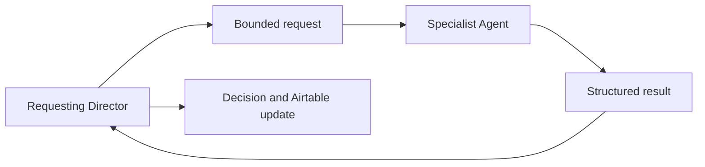

# Legacy Hub Specialist Agents

## Purpose

Specialist Agents are shared services that provide narrowly defined expertise to a requesting Director. They are never an employee's front door, never communicate directly with employees, never own customers or workflows, and never assume authority for customer-facing or financial actions.

Directors perform work directly whenever possible. A Specialist Agent exists only when reusable, bounded expertise is needed across one or more business seats.

## Specialist Agent contract

Each Specialist Agent definition must document:

- Purpose and bounded scope
- Permitted systems and data
- Required inputs from the requesting Director
- Structured output returned to the requesting Director
- Approval requirements
- Error, conflict, and missing-information behavior
- Airtable recordkeeping location

Every Specialist Agent must return its result to the requesting Director. The Director owns the next decision, Airtable update, customer communication, and workflow completion.

## Current specialist roster

| Specialist Agent | Purpose | Permitted systems | Structured result | Status |
| --- | --- | --- | --- | --- |
| **Plant Library Agent** | Build and maintain plant and gallon-size knowledge records and asset completeness | Airtable, Google Drive, approved research sources | Plant record updates, research draft, and missing-asset list | Planned |
| **Design Agent** | Prepare bounded design support such as plant palettes, mood-board inputs, and design assets from approved context | Airtable, Google Drive, approved design tools/templates | Design asset references, assumptions, and readiness result | Planned |
| **Photo Library Agent** | Classify, organize, and link approved photos and related files | Airtable, Google Drive | File locations, Airtable references, and missing-metadata list | Planned |
| **Financial Analysis Agent** | Prepare authorized financial analysis and exception summaries from approved data | Airtable and approved financial data sources | Analysis brief, source references, assumptions, and red flags | Planned |

## Specialist boundaries

| Specialist Agent | Must not do |
| --- | --- |
| Plant Library Agent | Treat unverified research as final plant guidance or overwrite approved records without change tracking |
| Design Agent | Manage a customer, own a proposal workflow, send customer email, or make a pricing commitment |
| Photo Library Agent | Decide business workflow status, communicate with employees, or delete/relocate files outside its approved task |
| Financial Analysis Agent | Make financial commitments, initiate transactions, or disclose restricted data outside authorized access |

## Standard result schema

All Specialist Agent results should be representable with the following fields:

| Field | Description |
| --- | --- |
| `request_id` | Source request or linked Airtable record |
| `requesting_director` | Director that requested and remains accountable for the work |
| `status` | `complete`, `needs_review`, `blocked`, or `failed` |
| `summary` | Concise human-readable result |
| `outputs` | Links/IDs for drafts, records, files, or recommendations |
| `missing_information` | Required gaps that prevented completion |
| `red_flags` | Issues requiring visibility or escalation |
| `approval_required` | Whether a human must approve the next action |
| `next_owner` | The requesting Director or an explicitly named human role; never the Specialist Agent |

## Request and completion flow

The Director—not the Specialist Agent—communicates with the employee or customer, manages calendar and task changes, and completes the business workflow.

## Future Specialist Agents

| Candidate | Trigger to add | Status |
| --- | --- | --- |
| Website Content Agent | Website content workflow, permissions, and approvals are defined | TBD |
| Maintenance Intelligence Agent | Maintenance data capture and exception rules are stable | TBD |
| Additional specialist | A documented shared expertise need cannot be performed directly by the relevant Director | TBD |

## Open decisions

- Specialist Agent runtime/platform selection: **TBD**
- Evaluation and quality thresholds per Specialist Agent: **TBD**
- Versioning and release process for Specialist Agent instructions: **TBD**
- Human review interface and notification method: **TBD**
