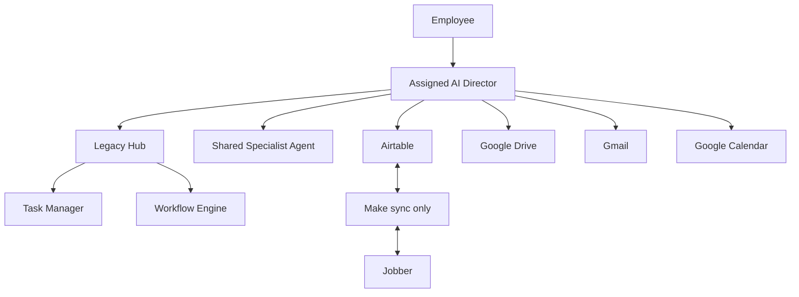
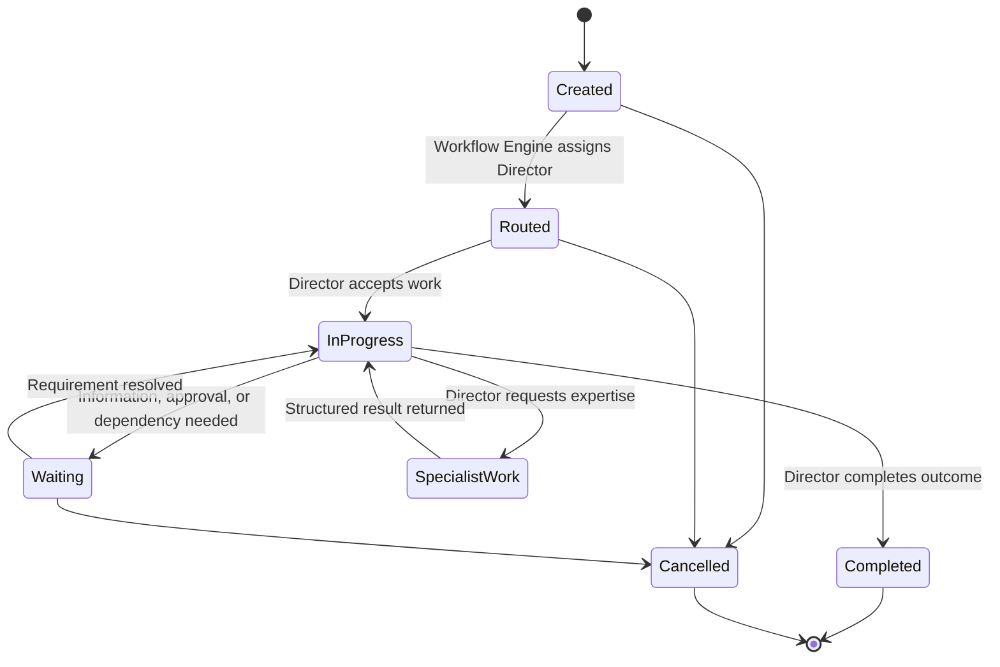

# Legacy Hub Architecture

## Purpose

Legacy Hub is the operating layer for Legacy. It manages the people-facing AI structure, workflow state, tasks, permissions, activity history, and configuration required to run work safely.

Legacy Hub is responsible for:

- Director Registry
- Specialist Agent Registry
- Workflow Engine
- Task Manager
- Permission Management
- Activity Logging
- Configuration Management

Legacy Hub does **not** make business decisions. Business decisions belong to the Director assigned to the Task.

## Architecture principles

- The architecture is organized around **business seats**. Each employee has one AI Director: the employee's front door to Legacy.
- A Director owns the complete workflow for its business seat and makes decisions within its approved role.
- Specialist Agents are shared services. They never communicate directly with employees or own customer relationships.
- Airtable is the source of truth for structured Legacy data. Google Drive stores files; Airtable stores their references.
- Make has one narrow external responsibility: synchronize approved structured Airtable data with Jobber. No business logic belongs in Make.
- Every request creates a Task. The Task, not a chat message or a file, is the object that moves through the workflow.

## Component model

## Responsibilities by component

| Component | Responsibilities | Must not do |
| --- | --- | --- |
| **Director** | Own seat workflow, make role-authorized business decisions, communicate with customers, schedule, manage Tasks, update Airtable, organize/read Drive, use Gmail and Calendar, request specialist work | Delegate ownership of a workflow or customer to a Specialist Agent |
| **Specialist Agent** | Perform bounded expert work and return structured results to the requesting Director | Communicate directly with employees/customers, make workflow decisions, own customers or Tasks |
| **Workflow Engine** | Track state, route Tasks, invoke Directors, invoke Specialists at a Director's request, maintain audit history | Decide business outcome, choose customer terms, approve transactions, or invent workflow policy |
| **Task Manager** | Create, assign, prioritize, date, update, and close Tasks | Make a business decision about a Task |
| **Director Registry** | Define active Directors, seats, tools, permissions, and supported workflows | Assign authority not approved in configuration |
| **Specialist Agent Registry** | Define shared Specialists, capabilities, permitted inputs/outputs, and invocation rules | Give Specialists direct employee-facing access |
| **Permission Management** | Enforce approved access to tools, data, and actions | Allow indirect permission escalation |
| **Activity Logging** | Preserve inputs, assignments, decisions, actions, timestamps, and outcomes | Replace source records or approval requirements |
| **Configuration Management** | Store workflow definitions, routing rules, permissions, templates, and feature settings | Make runtime business decisions |
| **Airtable** | Store structured business data, Task records, workflow state, registries, logs, and Drive references | Store canonical files |
| **Google Drive** | Store photos, voice notes, documents, proposals, templates, and other files | Be the structured workflow database |
| **Make** | Synchronize approved structured Airtable data with Jobber | Route Director work, decide logic, or communicate between Directors |
| **Jobber** | Operate customer transaction records synchronized from approved Airtable data | Own Legacy workflow state or AI decisioning |

## Task lifecycle

The Workflow Engine changes state and records events. The assigned Director decides whether the Task needs a Specialist, customer communication, a schedule action, or another approved business action.

## Workflow Engine contract

For every Task, the Workflow Engine must:

1. Create or receive the Task with a unique Task ID.
2. Identify the Workflow Type.
3. Assign the responsible Director using configured routing rules.
4. Track status, priority, due date, assignments, and timestamps.
5. Record every routing, action request, result, and state change in the audit history.
6. Invoke a Specialist Agent only when the assigned Director requests it under that Specialist's registry permissions.
7. Return control and structured results to the assigned Director.

It must never determine pricing, approve a customer exception, select a design, authorize a quote, or make any other business decision.

## Core integrations

| Integration | Connection model | Allowed purpose |
| --- | --- | --- |
| Airtable | Direct to Directors and Legacy Hub | Structured data, Task records, workflow state, registries, logs, and reporting |
| Google Drive | Direct to Directors | Read, organize, and link files; preserve durable artifacts |
| Gmail | Direct to Directors | Send and receive customer and internal email under applicable approval rules |
| Google Calendar | Direct to Directors | Manage schedule and calendar work for the Director's seat |
| Make | Airtable ↔ Jobber only | Synchronize approved structured data |
| Jobber | Through the approved Airtable synchronization boundary | Customer transaction synchronization |

## Audit, permissions, and configuration

Every meaningful action must be attributable to a Task and include the actor, timestamp, input/source, outcome, and any approval reference. Permission checks occur before a Director or Specialist uses a tool or data set.

Configuration defines:

- Director-to-seat assignments
- Supported workflow types and routing rules
- Specialist capabilities and input/output schemas
- Tool and data permissions
- Task status, priority, and due-date rules
- Approval requirements and message/document templates
- Airtable-to-Jobber synchronization mappings

## Implementation constraints

- Do not permit a Specialist Agent to initiate employee or customer communication.
- Do not let Make contain decision trees, approval logic, or Director-to-Director communication.
- Do not use a chat thread as the authoritative workflow record; link it to the Task if it is relevant.
- Preserve cross-system identifiers and timestamps so Airtable↔Jobber synchronization is traceable and idempotent.
