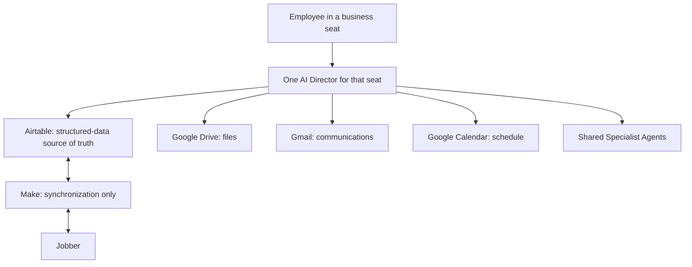

# Legacy Hub Architecture

## Architecture summary

Legacy Hub is organized around business seats. Each employee works through exactly one AI Director, which owns that seat's end-to-end workflow. Directors work directly in the connected applications and call shared Specialist Agents only for bounded expertise.

## System responsibilities

| System | Responsibility | Does not own |
| --- | --- | --- |
| **Airtable** | Source of truth for all structured business information, workflow state, dashboards, tasks, red flags, decisions, and references to files and Jobber records | Durable file storage |
| **Google Drive** | Documents, photos, voice files, proposal files, templates, archives, and durable company knowledge | Structured workflow state or business decisions |
| **Gmail** | Customer and internal email communication managed by the appropriate Director | Workflow ownership or structured business data |
| **Google Calendar** | Calendar and scheduling work managed by the appropriate Director | Workflow ownership or structured business data |
| **Specialist Agents** | Bounded shared expertise and structured results for requesting Directors | Employee interaction, customers, workflow ownership, or autonomous decisions |
| **Make** | Synchronization of approved structured Airtable data with Jobber | Business logic, decisions, customer communication, workflow state, or agent routing |
| **Jobber** | External service system for the defined data synchronized with Airtable | Legacy workflow ownership, AI routing, or the structured-data source of truth |

## Logical layers

### 1. Seat experience layer

An employee interacts with one Director for their business seat. The Director is the front door and manages the entire seat workflow, including customer communication, tasks, scheduling, calendar work, and role-appropriate business decisions.

### 2. Connected application layer

Every Director accesses Airtable, Google Drive, Gmail, and Google Calendar directly. Airtable stores structured data and links to Drive files; Drive stores the files themselves.

### 3. Shared expertise layer

A Director may request a bounded service from a Specialist Agent, such as plant research, design preparation, photo organization, or financial analysis. The Specialist Agent returns a structured result only to that Director. The Director remains accountable for the next action.

### 4. External synchronization layer

Make synchronizes the approved Airtable field contract with Jobber. No business logic belongs in Make. Make is never a Director, an employee communication channel, a customer owner, or an agent-to-agent pathway.

## Data and synchronization rules

- Airtable is the source of truth for all structured business information.
- Google Drive stores files; Airtable stores the related links and metadata.
- Directors update Airtable directly as they work.
- Make moves only defined structured fields between Airtable and Jobber.
- A synchronization failure creates a visible Airtable exception or red flag; Make does not decide how to resolve it.
- Do not create duplicate customers or properties without verification in Airtable.
- Directors, not Make, apply approval rules before customer-impacting or financial actions.

## Security and permissions

| Area | Default policy | Details |
| --- | --- | --- |
| Director access | Direct access to Airtable, Drive, Gmail, and Calendar | Actions remain limited by the Director's seat permissions and approval rules. |
| Customer communications | Draft only until authorized approval | Sender, approver, and final message must be retained in Airtable. |
| Jobber synchronization | Defined Airtable fields only | Make has no authority beyond the approved synchronization contract. |
| Financial data | Restricted to approved financial roles and Specialist Agents | Exact role matrix is TBD. |
| Google Drive files | Least-privilege access by folder/workspace | Folder-level policy is TBD. |
| Specialist tools | Minimum tools required for the bounded service | No indirect permission escalation through a Director or another Specialist Agent. |

## Operational requirements

- **Traceability:** record source input, decision, actor, timestamps, and final status in Airtable.
- **Reliability:** failed synchronization creates a visible exception or red flag.
- **Idempotency:** synchronization must avoid duplicate records and transactions.
- **Auditability:** customer, financial, and approval actions must be reconstructable.
- **Portability:** Airtable exports and documented schemas must allow future migration.

## Open architecture decisions

- Authentication and role provisioning approach: **TBD**
- Make-to-Jobber synchronization field catalog: **TBD**
- Error retry and reconciliation standard: **TBD**
- Folder naming and lifecycle policy: **TBD**
- API credential storage and rotation policy: **TBD**
