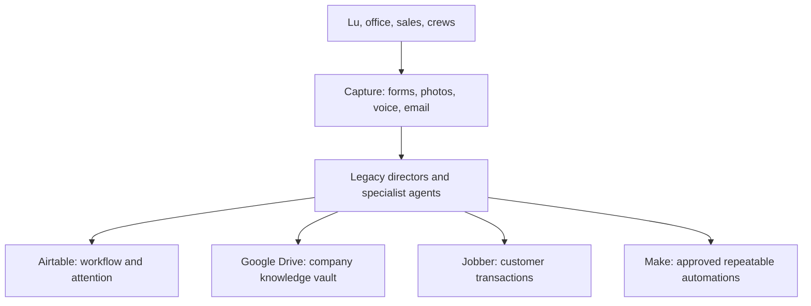

# Legacy Hub Architecture

## Architecture summary

Legacy Hub connects a governed intelligence layer to the business systems that already own company data and transactions. It does not attempt to duplicate every external system.

## System responsibilities

| System | Responsibility | Does not own |
| --- | --- | --- |
| **Google Drive** | Documents, photos, voice files, proposal files, templates, archives, and durable company knowledge | Workflow status or customer-facing transactions |
| **Airtable** | Structured operational data, dashboards, workspaces, tasks, red flags, and reporting | Canonical file storage or transaction execution |
| **Jobber** | Customer-facing quotes, approvals, deposits, scheduling, invoices, and related transaction history | Legacy knowledge, internal intelligence, or AI routing |
| **Make** | Repeatable, approved orchestration between systems | Business policy or unreviewed decisions |
| **ChatGPT / AI services** | Analysis, drafting, extraction, summarization, classification, and controlled specialist work | Unapproved external actions or authoritative transaction records |

## Logical layers

### 1. Capture layer

Inputs arrive through forms, uploads, voice notes, photos, email, and operator entry. Every input should be associated with the appropriate customer, property, project, or intake record before downstream work begins.

### 2. Knowledge and data layer

Google Drive stores durable artifacts. Airtable stores structured relationships, lifecycle state, assignments, and operational attention. Each record should link to its source files rather than duplicate them where practical.

### 3. Intelligence and routing layer

Directors interpret the request, enforce scope and approval rules, choose a specialist agent, and return structured results. Specialists must not expand their own permission scope.

### 4. Transaction and delivery layer

Jobber remains the customer transaction system. Make executes repeatable integrations after the workflow is defined, tested, and approved.

### 5. Experience layer

Airtable Interfaces initially provide owner, sales/design, account manager, and crew leader views. Future interface technology is TBD.

## Integration rules

- Use API and webhook integrations only after a manual workflow is proven.
- Preserve source links, timestamps, responsible party, and approval state for automated actions.
- Treat external API writes as controlled actions with validation and logging.
- Do not create duplicate customers or properties without verification.
- Jobber API actions that create or alter quotes, invoices, payments, or schedules require the approval rule defined in the relevant workflow.

## Security and permissions

| Area | Default policy | Details |
| --- | --- | --- |
| Customer communications | Draft only until authorized approval | Sender, approver, and final message must be retained. |
| Quotes and invoices | Draft only until authorized approval | Jobber is the transaction authority. |
| Financial data | Restricted to approved financial roles and agents | Exact role matrix is TBD. |
| Google Drive files | Least-privilege access by folder/workspace | Folder-level policy is TBD. |
| Agent tools | Minimum tools required for the assigned task | No indirect permission escalation through another agent. |

## Operational requirements

- **Traceability:** record source input, decision, actor, timestamps, and final status.
- **Reliability:** failed automations create a visible exception or red flag.
- **Idempotency:** repeatable workflows must avoid duplicate records and transactions.
- **Auditability:** customer, financial, and approval actions must be reconstructable.
- **Portability:** data exports and documented schemas must allow future migration.

## Open architecture decisions

- Authentication and role provisioning approach: **TBD**
- Webhook/event catalog: **TBD**
- Error retry and reconciliation standard: **TBD**
- Folder naming and lifecycle policy: **TBD**
- API credential storage and rotation policy: **TBD**
