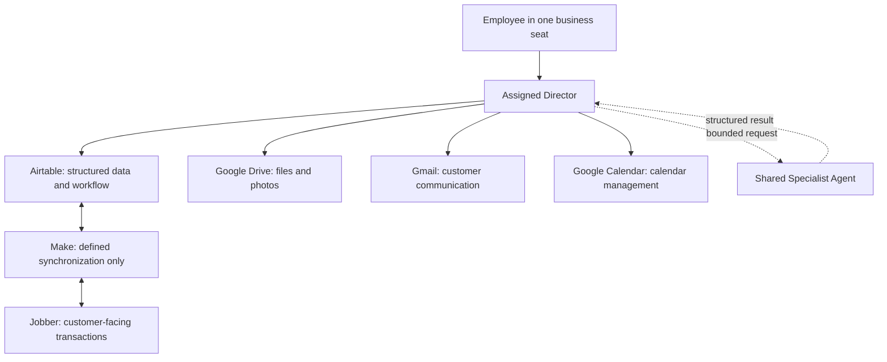

# Legacy Hub Architecture

## Legacy v1 architecture

Legacy v1 is a seat-based operating model. Each employee interacts with exactly one assigned Director. There is no central AI Director, super Director, Operations Director, or Financial Intelligence Director in v1.

## Included components

| Component | Legacy v1 responsibility | Does not do |
| --- | --- | --- |
| **Owner Director** | Owner priorities, approvals, cross-seat visibility, and owner workflow | Replace another employee's assigned Director |
| **Design & Sales Director** | Design/sales workflow, proposal workflow, and sales communication | Become a standalone quote agent |
| **Account Manager Director** | Property relationship, evaluations, customer communication, and schedule coordination | Become an Operations Director |
| **Crew Leader Director** | Daily crew management, field capture, job status, and field escalation | Make customer or financial commitments outside approval rules |
| **Specialist Agents** | Bounded expertise and structured results for Directors | Employee interaction, workflow ownership, or customer ownership |
| **Airtable** | Structured business data, tasks, workflow state, links, dashboards, and sync records | Durable file storage or customer-facing transaction execution |
| **Google Drive** | Documents, photos, voice notes, designs, and other files | Structured workflow state |
| **Gmail / Google Calendar** | Communication and calendar actions performed by Directors | Legacy's authoritative structured record |
| **Make** | Defined synchronization between Airtable and Jobber | Business logic, decisions, employee routing, or communication |
| **Jobber** | Customer-facing quote, scheduling, and invoice transactions | Legacy workflow ownership or internal company knowledge |

## Director interaction rules

- An employee uses only the Director assigned to that employee's business seat.
- A Director may communicate directly with another Director when a request crosses seats; the receiving Director owns its own seat's next work.
- No Director has universal workflow ownership. The Owner Director provides owner-level visibility and decisions, not a central intake layer.
- Directors perform work directly whenever possible and use a Specialist Agent only for the agent's defined shared expertise.

## Information and synchronization rules

1. Directors create and update structured business records in Airtable.
2. Directors store files in Google Drive and link them from Airtable.
3. Directors send and receive Gmail, manage Google Calendar, and record material workflow outcomes back in Airtable.
4. Make synchronizes only approved, mapped Airtable fields and statuses with Jobber. It contains no business policy or decision tree.
5. Jobber transaction changes returned through Make are reconciled into the linked Airtable records, with source IDs and timestamps.
6. A failed or conflicting synchronization creates an Airtable exception for the responsible Director; Make does not decide how to resolve it.

## Security and approvals

| Area | Legacy v1 rule |
| --- | --- |
| Customer communication | Director prepares and sends only within the approved workflow and human-approval rule. |
| Quotes, schedules, and invoices | Jobber performs the customer-facing transaction; its linked Airtable record retains workflow context and approval state. |
| Financial analysis | The Financial Analysis Agent provides structured analysis only; an authorized Director or human makes the business decision. |
| Specialist access | Minimum data and tool access needed for the bounded request; no indirect permission escalation. |
| Audit trail | Airtable records source, owner, decision, status, external IDs, and timestamps. |

## Future Releases

- Additional Directors, including Operations and Financial Intelligence Directors
- Additional specialist agents and integrations
- Custom application/interface replacement for Airtable Interfaces
- Broader automation only after the relevant manual workflow and data mapping are proven

## Open decisions

- Identity and role-provisioning model: **TBD**
- Airtable-to-Jobber field mappings and reconciliation schedule: **TBD**
- Folder naming/lifecycle standard: **TBD**
- Approval thresholds by transaction type: **TBD**
