# Legacy Hub Data Model

## Modeling principles

- Keep one authoritative record for each business entity and link related records rather than duplicating information.
- Preserve original files in Google Drive; store structured references and workflow state in Airtable.
- Track lifecycle state, owner, timestamps, source, and approval status for meaningful work.
- Use controlled values for stages, roles, priorities, and statuses where possible.
- Every automation must be able to identify the record it created or updated.

## Core entities

| Entity | Purpose | System of record | Key relationships |
| --- | --- | --- | --- |
| Customer | Individual or organization receiving service | Jobber / mirrored reference in Airtable | Has properties, contacts, projects, quotes, invoices |
| Property | Service location and site-specific knowledge | Jobber / Airtable workspace | Belongs to customer; has evaluations, projects, maintenance profile |
| Contact | Person associated with a customer/property | Jobber | Belongs to customer; may be decision maker or billing contact |
| Lead / Intake | Initial request and qualification context | Airtable | Converts to customer/property or links to existing records |
| Consultation | Captured meeting/site-visit context | Airtable | Links to customer, property, project, files, follow-ups |
| Opportunity / Project | Sales and production container for a service scope | Airtable + Jobber reference | Links to consultation, quote, files, tasks, red flags |
| Quote / Proposal | Customer-facing scope, pricing, presentation, and approval state | Jobber; proposal artifacts in Drive | Belongs to project/customer/property |
| Invoice / Payment status | Billing and collection state | Jobber | Links to project/customer/property |
| Task / Follow-up | Assigned internal action | Airtable | Links to any operational entity |
| Red flag | Exception requiring owner and resolution | Airtable | Links to affected entity and workflow |
| File / Asset | Source photo, voice note, document, render, proposal, or reference | Google Drive | Linked from Airtable entities |
| Plant catalog item | Plant information at a specific gallon size | Airtable; assets in Drive | Links to plant assets, research, approved descriptions |
| Property evaluation | Structured inspection and opportunity assessment | Airtable + Drive | Belongs to property; generates reports and opportunities |

## Lifecycle stages

```mermaid
flowchart LR
    Lead --> Scheduled --> Consulted["Consultation completed"] --> Proposal["Proposal in progress"] --> Presented --> Approved["Approved / deposit"] --> ScheduledJob["Scheduled"] --> InProgress["In progress"] --> Walkthrough["Final walkthrough"] --> Completed["Completed / warranty"] --> Lifetime["Customer for life"]
```

## Required common fields

| Field | Purpose |
| --- | --- |
| `legacy_id` | Stable Legacy identifier for cross-system relationships |
| `external_id` | Associated Jobber, Drive, or other system identifier |
| `status` | Current lifecycle or workflow state |
| `owner` | Human role responsible for next action |
| `source` | Where the information originated |
| `created_at` / `updated_at` | Audit timestamps |
| `approval_status` | Draft, pending review, approved, rejected, or not required |
| `drive_folder_url` / `file_urls` | Links to durable artifacts |

## Plant library minimum record

Each plant **and gallon size** is an individual inventory/knowledge record. This supports complete asset tracking and lets Legacy answer what plant records or sizes are incomplete.

| Field group | Minimum fields |
| --- | --- |
| Identity | Botanical name, common name, gallon size, supplier item reference (TBD) |
| Availability | Availability status, last verified date, supplier/source (TBD) |
| Knowledge | Approved description, care guidance, design uses, research status |
| Assets | Photo status, photo links, care-guide status, document links |
| Completeness | Overall status, missing items, reviewer, last updated |

## Key relationship rules

- A customer may have multiple properties and contacts.
- A property may have multiple consultations, projects, evaluations, and maintenance records.
- A project may contain multiple quote revisions but must identify the active/current version.
- Files belong in Drive and are linked to their relevant business records.
- Red flags and tasks must always name an owner and a resolution state.
- Customer/property duplication must be checked before creation.

## Controlled lists to define

- Service types: **TBD**
- Project and proposal status values: **TBD**
- Red-flag categories and severity: **TBD**
- Approval roles and thresholds: **TBD**
- File categories and folder naming convention: **TBD**
- Maintenance vs. commercial classification values: **TBD**
