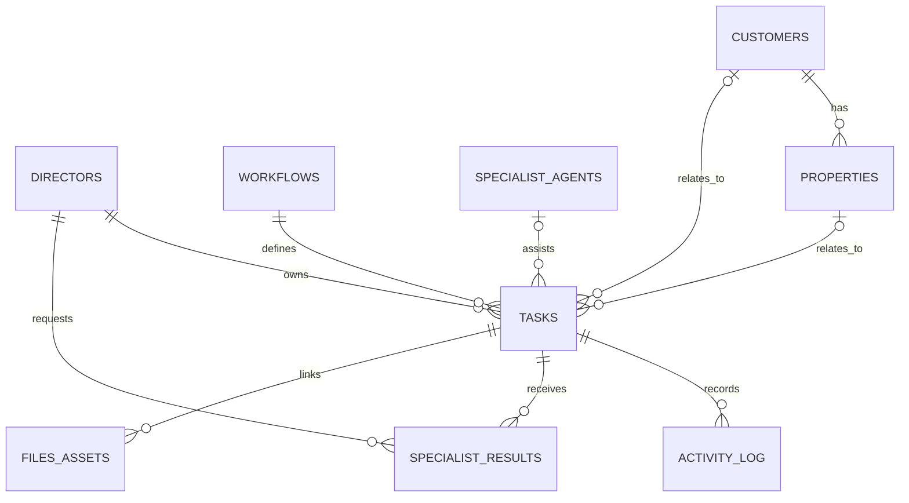

# Legacy Hub Data Model

## Modeling rules

- Airtable is the source of truth for structured Legacy information.
- Google Drive stores files; Airtable stores the file IDs, URLs, classifications, and relationships.
- Every request creates one Task. A Task is the workflow object from intake through completion or cancellation.
- Keep a stable Legacy ID for each record and preserve cross-system identifiers for all synchronized Jobber records.
- Record the responsible Director, lifecycle state, timestamps, sources, and approvals for meaningful work.
- Specialist output is structured, attached to the requesting Task, and returned to the requesting Director.

## Core tables

| Table | Purpose | Key fields |
| --- | --- | --- |
| **Tasks** | One record for every request and workflow item | Task ID, Workflow Type, Status, Assigned Director, Assigned Specialist Agent, Customer, Property, Priority, Due Date, Created Date, Last Updated |
| **Workflows** | Configured workflow definitions and routing behavior | Workflow Type, Trigger, initial status, allowed statuses, default Director seat, task template, escalation rule, active |
| **Directors** | Director Registry; one Director per business seat | Director ID, Director Name, Business Seat, Responsibilities, Permissions, Connected Apps, Supported Workflows, active |
| **Specialist Agents** | Shared Specialist Agent Registry | Agent ID, Agent Name, Capability, allowed inputs, output schema, permission scope, requesting Director rules, active |
| **Permissions** | Tool, data, and action permissions | Permission ID, subject type, subject ID, resource, action, scope, approval requirement, active |
| **Activity Log** | Immutable business and workflow audit events | Event ID, Task, actor type, actor ID, event type, timestamp, input/source reference, outcome, approval reference |
| **Configuration** | Runtime configuration that is not a business decision | Configuration key, value, version, owner, effective date, active |
| **Customers** | Structured customer identity and relationship data | Customer ID, name, contacts, status, Airtable/Jobber references |
| **Properties** | Property and service-location records | Property ID, Customer, address, profile, Airtable/Jobber references |
| **Files / Assets** | Structured references to Google Drive artifacts | Asset ID, Drive file ID, URL, category, linked Task/customer/property, uploaded date |
| **Specialist Results** | Structured results delivered to a Director | Result ID, Task, Specialist Agent, requested by Director, input reference, result schema/version, result status, returned date |

Additional operational tables—such as consultations, projects, quotes, invoices, plant catalog items, property evaluations, red flags, and follow-ups—link to the same Customer, Property, Task, file, and activity records.

## Task record

The Task table is required for every request. It must contain at least:

| Field | Type / rule | Purpose |
| --- | --- | --- |
| Task ID | Unique, immutable ID | Identifies the workflow object across Legacy |
| Workflow Type | Controlled list | Selects the configured workflow |
| Status | Controlled list | Shows the current workflow state |
| Assigned Director | Link to Directors; required | Names the Director who owns the business outcome |
| Assigned Specialist Agent | Link to Specialist Agents; optional | Names the shared service currently assisting |
| Customer | Link to Customers; optional until identified | Connects customer work |
| Property | Link to Properties; optional until identified | Connects property work |
| Priority | Controlled list | Supports attention and escalation |
| Due Date | Date/time; optional when no due date applies | Supports planning and overdue detection |
| Created Date | System timestamp | Preserves intake timing |
| Last Updated | System timestamp | Preserves current record timing |

Recommended implementation fields:

| Field | Purpose |
| --- | --- |
| Request Summary | Plain-language description of the request |
| Source | Intake origin: employee, email, form, file, calendar, or other approved source |
| Requester | Employee or system that initiated the Task |
| Decision Record | Director decision, rationale, and approval reference where needed |
| Next Action | Visible action needed to move the Task |
| Blocked Reason | Required when status is Waiting |
| Completed Date | Required when status is Completed |
| Cancelled Reason | Required when status is Cancelled |
| Jobber Sync Status | Synchronization result when the Task produces a relevant Jobber update |

## Controlled task statuses

| Status | Meaning | Allowed owner of decision |
| --- | --- | --- |
| Created | Request has been recorded | Workflow Engine records it |
| Routed | Director has been assigned | Workflow Engine applies configured routing |
| In Progress | Assigned Director is actively handling the Task | Assigned Director |
| Waiting | Information, authorization, or dependency is needed | Assigned Director |
| Specialist Work | A Director-requested Specialist is producing a result | Assigned Director retains ownership |
| Completed | Director has completed the business outcome | Assigned Director |
| Cancelled | Work will not proceed | Assigned Director or authorized human policy |

The Workflow Engine may move a Task according to configured mechanics, but it does not decide the business outcome.

## Director Registry

Every Director record includes:

| Field | Purpose |
| --- | --- |
| Director Name | Identifies the AI Director |
| Business Seat | Identifies the employee seat served by the Director |
| Responsibilities | Defines the business area and outcome ownership |
| Permissions | Links to approved data, tools, and actions |
| Connected Apps | Airtable, Google Drive, Gmail, and Google Calendar access applicable to the seat |
| Supported Workflows | Lists Workflow Types the Director may own |

One active Director maps to one active business seat. Directors may request shared Specialist Agents but retain Task, workflow, and customer ownership.

## Specialist Agent Registry

| Field | Purpose |
| --- | --- |
| Agent Name | Identifies the shared service |
| Capability | Defines the bounded expertise it provides |
| Allowed Inputs | Specifies the structured context it may receive |
| Output Schema | Defines the structured result returned to a Director |
| Permission Scope | Limits data, tools, and actions |
| Requesting Director Rules | Defines which Directors/workflows may invoke it |
| Status | Active, paused, retired, or TBD |

A Specialist Result must always reference its originating Task, the requesting Director, and the Specialist Agent. It cannot be used to reassign Task ownership.

## Activity Log and approvals

The Activity Log records, at minimum:

- Task ID
- actor type and actor ID
- event type
- event timestamp
- source/input reference
- result/output reference
- related Airtable, Drive, and Jobber identifiers
- approval reference when applicable

Examples of event types: Task created, Director assigned, status changed, Specialist requested, Specialist result returned, customer message drafted, customer message sent, Airtable record updated, Jobber synchronization attempted, Jobber synchronization completed, exception raised, and Task completed.

## Relationship rules

- A Task has one assigned Director at a time; reassignment is an Activity Log event.
- A Task may use zero or more Specialist Results, but its Director remains responsible.
- A Customer may have multiple Properties, Tasks, and files.
- Files remain in Google Drive and are linked from Airtable.
- Jobber identifiers are stored only for synchronization and reconciliation; Task status remains in Airtable.
- No Task may be completed without a recorded outcome and completing actor.

## Data integrity and synchronization

- Use lookup-first logic to avoid duplicate Customer and Property records.
- Store Jobber external IDs and last synchronization timestamps on synchronized records.
- Make may synchronize only approved structured Airtable changes with Jobber.
- A failed synchronization creates an Activity Log event and a visible Task exception; it does not silently retry a business decision.
- Preserve version and effective-date history for configuration, permissions, and workflow definitions.
