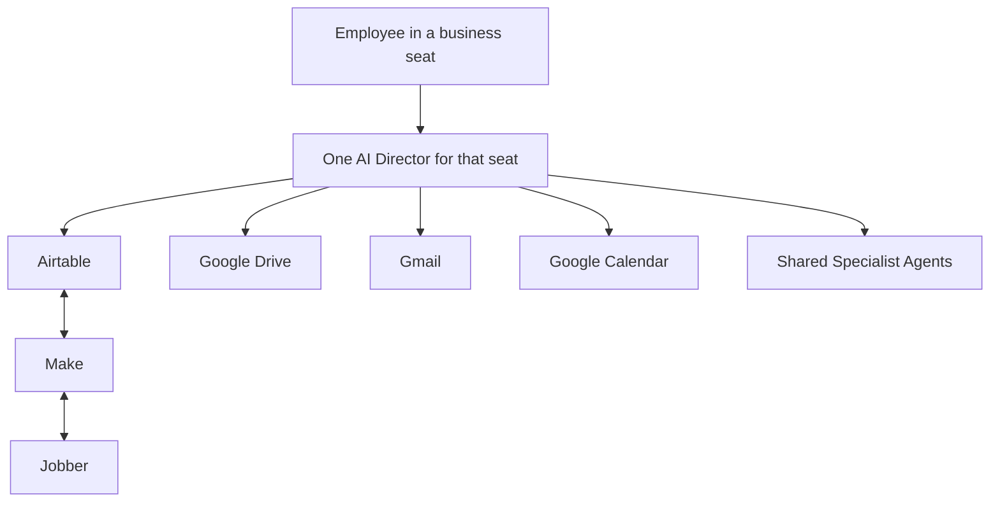
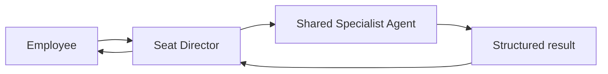

# Legacy Hub Directors

## Architecture principle

Legacy Hub is organized around **business seats**, not around a single central AI assistant.

Every business seat has exactly one AI Director. That Director is the front door for the employee in that seat and owns the complete business workflow for that role. Employees communicate with their own Director; they do not communicate with Specialist Agents.

## Director operating contract

Every Director must:

1. Serve as the employee's front door for requests, information, and work.
2. Own the full workflow for its business seat from intake through follow-up, exception handling, and completion.
3. Communicate with customers when communication is part of that seat's workflow and the required approval rules are satisfied.
4. Manage scheduling, tasks, and role-specific business decisions.
5. Create, update, and maintain the structured Airtable data for its workflow.
6. Use Google Drive for supporting files, Gmail for email, and Google Calendar for calendar and scheduling work.
7. Request bounded work from a shared Specialist Agent when specialized analysis, drafting, research, or preparation is needed.
8. Interpret the Specialist Agent's structured result, make the role-appropriate decision, and return the outcome to the employee.

Directors do not transfer ownership of a workflow to a Specialist Agent. A Specialist Agent supports the requesting Director; the Director remains accountable for the customer, task, data, decision, and next step.

## Direct access and system ownership

Every Director has direct access to the same core business systems.

| System | Director responsibility |
| --- | --- |
| **Airtable** | Read and update structured business data, task ownership, workflow state, red flags, and decisions. |
| **Google Drive** | Read, organize, create, and link supporting documents, photos, notes, templates, and final assets. |
| **Gmail** | Manage customer and internal email communication for the seat, subject to approval policy. |
| **Google Calendar** | Manage appointments, follow-ups, and scheduling work for the seat. |

The only external systems in this architecture are **Make** and **Jobber**.

| External system | Limited role |
| --- | --- |
| **Make** | Synchronizes structured Airtable data with Jobber only. It does not make business decisions, route employees to agents, manage customer conversations, or own workflow state. |
| **Jobber** | Receives and provides the customer-service and transaction data that is synchronized with Airtable through Make. |

## Business-seat Director roster

| Business seat | Its single AI Director | Workflow ownership | Primary employee |
| --- | --- | --- | --- |
| Owner | **Owner Director** | Company priorities, approvals, executive decisions, and cross-seat exceptions | Lu |
| Sales & Design | **Sales & Design Director** | Leads, consultations, proposal readiness, designs, customer follow-up, and sales scheduling | Sales/designer |
| Account Management | **Account Manager Director** | Property evaluations, ongoing customer communication, maintenance visibility, enhancement opportunities, and customer-for-life follow-up | Account manager |
| Operations | **Operations Director** | Project readiness, production scheduling, material readiness, field tasks, exceptions, closeout, and internal coordination | Operations / crew leadership |
| Financial Intelligence | **Financial Intelligence Director** | Authorized financial analysis, profitability visibility, cash-flow attention, and financial work routing | Authorized financial role |

The roster can grow only by adding a defined business seat and its one accountable Director. A Director is not shared across seats, and a seat does not have multiple Directors.

## Shared Specialist Agents

Specialist Agents are shared services. They never communicate directly with employees and never become the employee's front door.

### Specialist service contract

1. A Director sends the Specialist Agent a bounded request with the relevant Airtable record, context, constraints, and requested outcome.
2. The Specialist Agent performs only its defined service.
3. The Specialist Agent returns a structured result to the requesting Director.
4. The requesting Director decides the next business action, updates Airtable, and communicates with the employee or customer as appropriate.

### Example: quote preparation

1. A Sales & Design employee asks the **Sales & Design Director** to prepare a proposal.
2. The Director verifies the customer, property, scope, pricing inputs, files, and Airtable workflow state.
3. The Director asks the shared **Jobber Quote Agent** to prepare the quote/proposal draft.
4. The Jobber Quote Agent returns a structured readiness result and draft references to the Director.
5. The Sales & Design Director reviews the result, updates Airtable, manages the customer follow-up and calendar work, and handles any required approval.
6. When structured Airtable fields must be reflected in Jobber, **Make** synchronizes those fields. Make does not decide whether the proposal is ready or communicate with the employee or customer.

## Director-to-specialist request standard

| Field | Requirement |
| --- | --- |
| `request_id` | Linked Airtable record or unique workflow request ID |
| `requesting_director` | The Director that owns the seat workflow |
| `context` | Customer, property, project, source files, notes, and related records |
| `requested_outcome` | Specific bounded service and expected deliverable |
| `constraints` | Budget, timing, customer preferences, policy, and exclusions |
| `approval_status` | Draft, ready for review, approved, rejected, or not required |

## Specialist result standard

| Field | Requirement |
| --- | --- |
| `request_id` | Source request ID from the Director |
| `status` | `complete`, `needs_review`, `blocked`, or `failed` |
| `summary` | Concise service result |
| `outputs` | Links or IDs for drafts, files, records, or recommendations |
| `missing_information` | Gaps that prevented completion |
| `red_flags` | Issues that require the Director's attention |
| `recommended_next_step` | Suggested next action for the Director; not an autonomous decision |

## Escalation and decision rules

- Missing customer, property, scope, or approval information creates a visible Airtable exception; the Director does not guess.
- Conflicting instructions escalate to the human accountable for that seat or to the Owner Director when the conflict crosses seats.
- Customer-impacting, financial, legal, safety, and irreversible actions follow the approval rule defined for the seat workflow.
- The Director owns the business decision within its role. It may request specialist input, but it does not delegate role accountability.
- Make is never an escalation path or decision-maker; it only performs the defined Airtable-to-Jobber synchronization.

## Open decisions

- Final employee-to-business-seat assignments and backup coverage: **TBD**
- Exact approval matrix for each seat and customer-facing action: **TBD**
- Airtable field-level ownership by Director: **TBD**
- Jobber fields included in the Make synchronization contract: **TBD**
