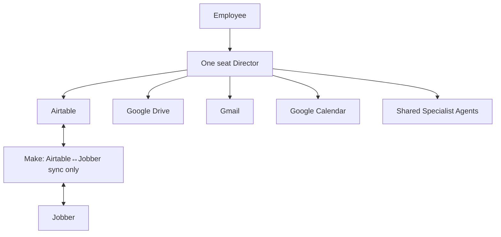
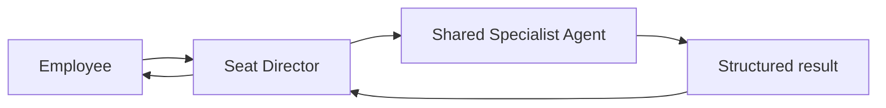

# Legacy Hub Directors

## Architecture principle

Legacy Hub is organized around **business seats**.

Every employee has exactly one AI Director. That Director is the employee's front door and owns the complete business workflow for that employee's seat. Employees never interact directly with Specialist Agents.

## Director operating contract

Every Director must:

1. Serve as its employee's front door for requests, information, and work.
2. Own the full workflow for its business seat from intake through follow-up, exception handling, and completion.
3. Handle customer communication for the seat when the required approval rules are satisfied.
4. Manage scheduling, calendar work, tasks, and role-specific business decisions.
5. Create, update, and maintain the structured Airtable data for its workflow.
6. Read and organize supporting files in Google Drive.
7. Send and receive Gmail for the seat, subject to approval policy.
8. Request bounded work from a shared Specialist Agent only when specialized expertise is required.
9. Interpret the Specialist Agent's structured result, make the role-appropriate decision, and complete the next action.

Directors should perform work directly whenever possible. They do not transfer workflow or customer ownership to a Specialist Agent.

## Direct access and system ownership

Every Director has direct access to the same core business systems.

| System | Director responsibility |
| --- | --- |
| **Airtable** | Read and update all relevant structured business data, task ownership, workflow state, red flags, and decisions. |
| **Google Drive** | Read, organize, create, and link supporting documents, photos, notes, templates, and final assets. |
| **Gmail** | Manage customer and internal email communication for the seat, subject to approval policy. |
| **Google Calendar** | Manage appointments, follow-ups, and scheduling work for the seat. |

The only external systems are **Make** and **Jobber**.

| External system | Limited role |
| --- | --- |
| **Make** | Synchronizes defined structured Airtable data with Jobber only. It does not contain business logic, make decisions, route employees to agents, manage customer conversations, or own workflow state. |
| **Jobber** | The external system that receives and provides the data covered by the Airtable synchronization contract. |

## Business-seat Director roster

The following is an initial example. Each employee receives one Director for their assigned business seat; a Director never spans multiple employee seats.

| Business seat | Its single AI Director | Workflow ownership |
| --- | --- | --- |
| Owner | **Owner Director** | Company priorities, approvals, executive decisions, and cross-seat exceptions |
| Sales & Design | **Sales & Design Director** | Leads, consultations, proposals, designs, customer follow-up, and sales scheduling |
| Account Management | **Account Manager Director** | Property evaluations, ongoing customer communication, maintenance visibility, enhancement opportunities, and customer-for-life follow-up |
| Crew Leadership | **Crew Leader Director** | Daily field tasks, crew capture, job updates, issues, and internal scheduling coordination |

Adding a Director requires a defined employee seat and a clear workflow boundary. Do not add a Director merely to create another business function.

## Shared Specialist Agents

Specialist Agents are shared services. They never communicate directly with employees, own a workflow, or own a customer.

### Specialist service contract

1. A Director sends the Specialist Agent a bounded request with the relevant Airtable record, context, constraints, and requested outcome.
2. The Specialist Agent performs only its defined service.
3. The Specialist Agent returns a structured result to the requesting Director.
4. The requesting Director decides the next business action, updates Airtable, and communicates with the employee or customer as appropriate.

### Example: proposal preparation

1. The Sales & Design employee asks the **Sales & Design Director** to prepare a proposal.
2. The Director verifies the customer, property, scope, pricing inputs, files, and Airtable workflow state.
3. The Director prepares the proposal directly. If a specialized design asset is needed, it asks the shared **Design Agent** for that bounded asset.
4. The Design Agent returns its structured result to the Director.
5. The Director finalizes the proposal workflow, updates Airtable, manages customer follow-up and calendar work, and handles any required approval.
6. Where a defined Jobber field must be synchronized, **Make** synchronizes it with Airtable. Make does not decide whether the proposal is ready or communicate with the employee or customer.

## Director-to-specialist request standard

| Field | Requirement |
| --- | --- |
| `request_id` | Linked Airtable record or unique workflow request ID |
| `requesting_director` | The Director that owns the employee-seat workflow |
| `context` | Customer, property, project, source files, notes, and related records |
| `requested_outcome` | Specific bounded service and expected deliverable |
| `constraints` | Budget, timing, customer preferences, policy, and exclusions |
| `approval_status` | Draft, ready for review, approved, rejected, or not required |

## Specialist result standard

| Field | Requirement |
| --- | --- |
| `request_id` | Source request ID from the Director |
| `status` | `complete`, `needs_review`, `blocked`, or `failed` |
| `summary` | Concise service result |
| `outputs` | Links or IDs for drafts, files, records, or recommendations |
| `missing_information` | Gaps that prevented completion |
| `red_flags` | Issues that require the Director's attention |
| `recommended_next_step` | Suggested next action for the Director; not an autonomous decision |

## Escalation and decision rules

- Missing customer, property, scope, or approval information creates a visible Airtable exception; the Director does not guess.
- Conflicting instructions escalate to the human accountable for the seat or to the Owner Director when the conflict crosses seats.
- Customer-impacting, financial, legal, safety, and irreversible actions follow the approval rule defined for the seat workflow.
- The Director owns the business decision within its role. It may request specialist input, but it does not delegate role accountability.
- Make is never an escalation path or decision-maker; it only performs the defined Airtable-to-Jobber synchronization.

## Open decisions

- Final employee-to-business-seat assignments and backup coverage: **TBD**
- Exact approval matrix for each seat and customer-facing action: **TBD**
- Airtable field-level ownership by Director: **TBD**
- Jobber fields included in the Make synchronization contract: **TBD**
