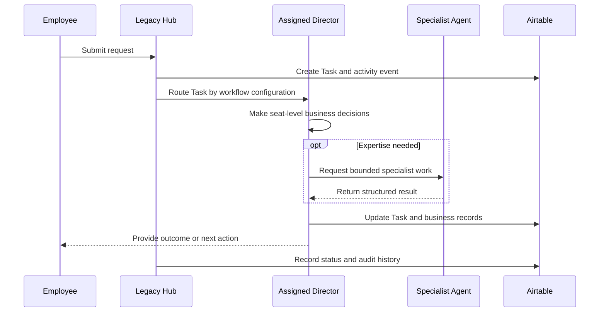

# Legacy Hub Workflows

## Workflow operating standard

Every request creates a Task. The Task is the object that moves through the workflow; it is not replaced by an email, chat, Drive file, Make scenario, or Jobber record.

Each workflow definition must state:

- Workflow Type
- Trigger
- Required intake fields
- Default Director seat
- Required checks
- Task statuses and valid transitions
- Specialist Agents that may be requested
- Expected structured outputs
- Approval rules
- Airtable updates
- Drive file requirements
- Jobber synchronization mapping, if any
- Exception and completion criteria

The Workflow Engine runs the mechanics: it creates, routes, tracks, and logs Tasks. It does not make business decisions. The assigned Director owns the business outcome.

## Standard request-to-completion flow

## Task creation and routing

### Trigger

Any employee request, inbound message, uploaded file, calendar item, form submission, system event, or manual intake that requires work.

### Workflow Engine responsibilities

1. Create a Task record with a unique Task ID.
2. Capture the request source, summary, requester, and available Customer/Property links.
3. Apply the configured Workflow Type.
4. Route the Task to the Director for the configured business seat.
5. Set the initial status to Created or Routed.
6. Write an Activity Log event for intake and assignment.

### Director responsibilities

1. Confirm or correct Customer and Property links.
2. Determine priority, due date, required information, and next action.
3. Make the business decision within the Director's approved role.
4. Update structured Airtable data and link relevant Drive files.
5. Request a Specialist Agent only when specialized expertise is necessary.
6. Complete the request, communicate the outcome, or place the Task in Waiting with a visible blocker.

### Completion

The Task has an assigned Director, a valid Workflow Type and status, required records are linked, and the intake/routing events are logged.

## Specialist Agent request and return

Specialists are shared services, not workflow owners.

1. The assigned Director creates a bounded specialist request linked to the Task.
2. The request includes only approved inputs and the expected output schema.
3. The Workflow Engine invokes the Specialist according to the Specialist Agent Registry.
4. The Specialist returns a structured result to the requesting Director.
5. The result is stored in Airtable, linked to the Task, and logged.
6. The Director evaluates the result, makes any business decision, and continues the Task.

A Specialist Agent must not contact the employee or customer, reassign the Task, change the Task's Director, or independently execute a customer-facing workflow.

## Director workflow pattern

The following pattern applies to every seat-specific workflow.

| Step | Owner | Required behavior |
| --- | --- | --- |
| Receive | Workflow Engine | Create and route the Task |
| Assess | Assigned Director | Review request, data, files, calendar, and relevant history |
| Decide | Assigned Director | Make the role-authorized business decision |
| Execute | Assigned Director | Communicate, schedule, update Airtable, organize Drive, and use Gmail/Calendar as needed |
| Assist | Specialist Agent, when requested | Return bounded structured expertise |
| Synchronize | Make, when mapping applies | Synchronize approved Airtable data with Jobber only |
| Close | Assigned Director | Record outcome, complete/close Task, and ensure follow-up ownership |

## Example workflow: new customer or property request

**Workflow Type:** New Customer Intake

**Default Director:** The Director responsible for the requesting employee's customer-intake seat.

1. Legacy Hub creates a Task with supplied contact/property details.
2. The assigned Director searches Airtable for matching Customer and Property records.
3. The Director determines whether the request belongs to an existing record or requires a new record.
4. The Director updates Airtable, links supplied Drive files, and records the decision.
5. When an approved Airtable-to-Jobber mapping applies, Make synchronizes the structured customer/property data.
6. The Director communicates next steps and completes the Task or records the blocker.

**Decision owner:** Assigned Director.  
**Workflow Engine role:** Track, route, and log only.  
**Make role:** Airtable↔Jobber structured-data synchronization only.

## Example workflow: consultation to proposal-ready work

**Workflow Type:** Consultation Follow-Up

**Default Director:** The Director responsible for the employee's sales/design seat.

1. Create a Task when consultation notes, photos, voice notes, measurements, or a follow-up request is received.
2. The Director links the Customer, Property, and Drive assets.
3. The Director decides what information, design work, pricing inputs, and approval requirements are needed.
4. If specialist expertise is needed, the Director requests it and receives a structured result.
5. The Director prepares the workflow outcome, including customer communication and required Airtable updates.
6. Where a Jobber record must be synchronized, Make synchronizes the approved structured Airtable data.
7. The Director completes the Task or records a visible missing-information blocker.

This workflow does not assign ownership to a Jobber Quote Agent. A Director may do the work directly or request only the specific shared expertise required.

## Example workflow: schedule or calendar request

**Workflow Type:** Schedule Management

**Default Director:** The Director responsible for the requesting employee's seat.

1. Create and route the Task.
2. The Director reviews the linked Customer, Property, existing calendar events, operational constraints, and relevant records.
3. The Director decides the appropriate schedule action within role permissions.
4. The Director updates Google Calendar and Airtable, records the reason and who must be notified, and sends required communication through Gmail.
5. If a structured Jobber schedule update is approved for synchronization, Make performs only that Airtable↔Jobber synchronization.
6. The Director records the final outcome and completes the Task.

## Status and exception rules

| Status | Required condition |
| --- | --- |
| Created | Task ID, source, and Workflow Type recorded |
| Routed | Assigned Director recorded |
| In Progress | Director has a current next action |
| Waiting | Blocked reason, owner, and next review date recorded |
| Specialist Work | Assigned Specialist and expected output recorded; Director remains owner |
| Completed | Outcome, completing actor, completion time, and required linked records recorded |
| Cancelled | Cancellation reason and authorizing actor recorded |

Red flags or exceptions must include the linked Task, severity, description, owner, next action, resolution status, and the relevant Activity Log event. Failed Jobber synchronization is an exception for the Director to resolve; it is not a reason for Make to make a new business decision.

## Airtable and Jobber boundary

- Airtable contains the Task, workflow status, Director assignment, decision record, and synchronization status.
- Google Drive contains the files referenced by the Task.
- Make synchronizes only approved structured Airtable data with Jobber.
- Jobber synchronization never replaces Task completion criteria or Director ownership.
- Director-to-Director work is handled through Legacy Hub Task routing and Activity Logging, never through Make.

## Workflow configuration checklist

Before enabling a workflow:

- Define the Workflow Type and default Director seat.
- Define required Task fields and valid status transitions.
- Define any approval checkpoints.
- Define allowed Specialist Agents and their output schemas.
- Define Airtable tables and Drive references affected.
- Define the exact, approved Airtable-to-Jobber mapping, if one exists.
- Test the workflow manually and verify the Activity Log.
- Confirm failure and escalation handling.
